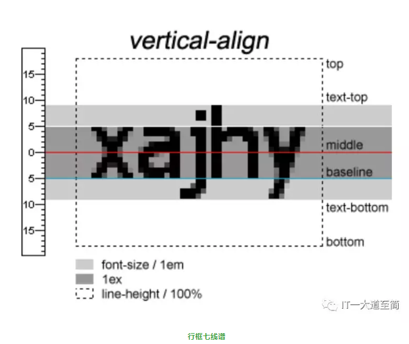

# 前端布局基础

<!-- @import "[TOC]" {cmd="toc" depthFrom=1 depthTo=6 orderedList=false} -->

<!-- code_chunk_output -->

- [前端布局基础](#前端布局基础)
  - [盒模型](#盒模型)
    - [box-sizing(css3)](#box-sizingcss3)
      - [box-sizing的浏览器兼容性](#box-sizing的浏览器兼容性)
      - [问题](#问题)
  - [元素的分类及其布局特性](#元素的分类及其布局特性)
    - [分类](#分类)
    - [布局特性](#布局特性)
      - [块级元素](#块级元素)
      - [行内级元素](#行内级元素)
        - [可置换行内元素](#可置换行内元素)
        - [不可置换行内元素](#不可置换行内元素)
      - [行内块级元素](#行内块级元素)
  - [格式化上下文（Formatting Context）](#格式化上下文formatting-context)
    - [BFC （Block Formatting Context）](#bfc-block-formatting-context)
      - [BFC 创建方式](#bfc-创建方式)
      - [BFC 特性](#bfc-特性)
    - [IFC (Inline Formatting Context)](#ifc-inline-formatting-context)
      - [IFC 创建方式](#ifc-创建方式)
      - [IFC 特性](#ifc-特性)
    - [FFC和GFC](#ffc和gfc)
  - [包含块（Containing Block）](#包含块containing-block)
    - [定义](#定义)
    - [ICB（initial containing block, 初始包含块）](#icbinitial-containing-block-初始包含块)
    - [不同定位元素分别对应的包含块](#不同定位元素分别对应的包含块)
  - [基本原理](#基本原理)
    - [文档流（正常流）](#文档流正常流)
      - [特性](#特性)
      - [脱离文档流](#脱离文档流)
    - [浮动（float属性）](#浮动float属性)
      - [浮动元素的分类](#浮动元素的分类)
      - [浮动原理](#浮动原理)
        - [浮动起始位置](#浮动起始位置)
        - [浮动方向](#浮动方向)
        - [浮动结束位置](#浮动结束位置)
      - [浮动对元素display的影响](#浮动对元素display的影响)
      - [清除浮动（clear属性）](#清除浮动clear属性)
        - [三要素](#三要素)
        - [clear属性的取值及应用场景](#clear属性的取值及应用场景)
      - [清除浮动后的margin合并问题](#清除浮动后的margin合并问题)
      - [清除浮动实践](#清除浮动实践)
    - [定位（position属性）](#定位position属性)
      - [定位元素的分类](#定位元素的分类)
      - [定位原理](#定位原理)
    - [line box（行框）](#line-box行框)
      - [行框定义](#行框定义)
      - [模型结构（七线谱）](#模型结构七线谱)
      - [高度计算](#高度计算)
      - [与line box行框有关的两个重要属性：line-height和vertical-align](#与line-box行框有关的两个重要属性line-height和vertical-align)
        - [line-height属性的取值](#line-height属性的取值)
        - [vertical-align属性](#vertical-align属性)
    - [margin](#margin)
      - [margin: 0 auto](#margin-0-auto)
      - [margin: auto 0](#margin-auto-0)
      - [margin合并（margin collapsing）](#margin合并margin-collapsing)
  - [参考](#参考)

<!-- /code_chunk_output -->

## 盒模型

由内到外分别是 content-area、padding-area、border-area、margin-area。如图：


- IE盒模型：border-box
- W3C盒模型：content-box

### box-sizing(css3)

作用：告诉浏览器CSS属性width和height是用于设置哪一种box的尺寸，是用IE盒模型还是W3C盒模型。

- content-box(即content area)
- padding-box(=content area + padding area)
- border-box(=content area + padding area + border area)
- margin-box(=content area + padding area + border area + margin area)

#### box-sizing的浏览器兼容性

box-sizing是CSS3属性，在IE8+（包含IE8）开始支持，然而在IE8，box-sizing的值为border-box时，不能与min-width, max-width, min-height或max-height的一起使用，因为IE8对min-*和max-*的解析，仍是作用于content-box，不受box-sizing属性控制。

#### 问题

如果想要全局使用IE盒模型，那么在reset.css中，该怎样设置box-sizing？

```css
html {
  -webkit-box-sizing: border-box;
  -moz-box-sizing: border-box;
  box-sizing: border-box;
}
*, *:before, *:after {
  -webkit-box-sizing: inherit;
  -moz-box-sizing: inherit;
  box-sizing: inherit;
}
```

这样设置的好处有：

1. 子元素的盒模型类型，默认由父元素决定，方便组件统一设置；
2. 支持低版本的浏览器：Safari (< 5.1), Chrome (< 10), and Firefox (< 29);

在封装组件时，记得**强声明box-sizing**，哪怕你使用默认的content-box。

## 元素的分类及其布局特性

### 分类

元素的布局特性来分，主要可以分为三类元素：block-level（块级）元素、inline-level（行内级）元素和inline-block-level（行内块级）元素。

- 块级元素：display属性取block、table、flex、grid和list-item等值的独占一行显示的元素。
- 行内级元素：display属性取inline值的可在同一行内排列显示的元素。
- 行内块级元素：display属性取inline-block、inline-table、inline-flex和inline-grid等值的兼具块级元素和行内级元素布局特性的元素。

### 布局特性

#### 块级元素

- 独占一行（width默认为100%，height为0）；
- 可以设置任何尺寸相关的属性（width、padding、margin和border）；

#### 行内级元素

##### 可置换行内元素

在MDN中，其对“可置换行内元素”的定义：“可置换行内元素”，是展示内容不在CSS作用域内的元素。我们可以换另外一种方式理解：“可置换行内元素”，是这样一类元素，其展示的内容是通过元素的src、value等属性或CSS content属性从外部引用得到的，可被替换的。典型的可替换元素有 \、 \<object>、 \<video> 和 \<embed>，表单类的可替换元素有\<textarea> 和\<input> ，某些元素只在一些特殊情况下表现为可替换元素，例如 \<audio> 、\<object>、\<canvas>和\<applet>。

##### 不可置换行内元素

“不可置换行内元素”其实就是我们常见的一类行内元素，这一类行内元素有\<a>和\<span>等。“不可置换行内元素”是相对于“可置换行内元素”的，其展示的内容是在CSS作用域范围内的，是不可替换的。

言归正传，行内级元素有如下几个布局特性：

- 在一行内可以与多个同类型的元素按从左到右的顺序排列；
- 不可置换行内元素**不能设置width、height和垂直方向上的margin**，而可置换行内元素则可以；
- 在水平和垂直方向上的对齐方式，行内级元素分别受父元素的text-align属性和自身vertical-align属性的控制（父元素是table-cell元素时，也受父元素的vertical-align属性控制），在水平方向上默认左对齐，在垂直方向上默认在行框的baseline基线上显示（“行框”的概念，会在后面深入讲解)；

#### 行内块级元素

行内块级元素兼具block-level元素和inline-level元素的布局特性，主要体现为：

- 排列方式与行内级元素同，不独占一行，在一行内按从左到右的顺序排列；
- 水平和垂直方向上的对齐方式与行内级元素同；
- 和块级元素一样，可以设置任何尺寸属性（但width默认为0）；

## 格式化上下文（Formatting Context）

格式化上下文，它指的是具有某种CSS格式化规则（布局规则）的上下文环境，在这个上下文环境内的所有子元素，都将根据其特定的CSS格式化规则来进行排列。

### BFC （Block Formatting Context）

BFC元素内部的渲染规则和普通块级元素内部的渲染规则很像，还是有一些不同的，我们会在后面讲解。

#### BFC 创建方式

创建BFC元素的方式有如下几种（摘自MDN BFC）：

- 根元素或其它包含它的元素
- 浮动元素 (元素的 float 不是 none)
- 绝对定位元素 (元素的 position 为 absolute 或 fixed)
- overflow 值不为 visible 的块元素
- 弹性项 (display: flex 或 inline-flex元素的子元素)
- 网格项 (display: grid 或 inline-grid 元素的子元素)
- 内联块 (元素具有 display: inline-block)
- 表格单元格 (元素具有 display: table-cell，HTML表格单元格默认属性)
- 表格标题 (元素具有 display: table-caption, HTML表格标题默认属性)
- display: flow-root
- contain为以下值的元素: layout, content, 或 strict
- 多列容器 (元素的 column-count 或 column-width 不为 auto， 包括 column-count: 1的元素)
- column-span: all 应当总是会创建一个新的格式化上下文，即便具有 column-span: all 的元素并不被包裹在一个多列容器中。

#### BFC 特性

- 对应一个独立、封闭的渲染区域，子元素的CSS样式不会影响BFC元素外部；
  - 普通块级元素，其子元素的margin-top，不会隔开自身与父元素（普通块级元素），但是会作用到父元素外部（将父元素和叔伯元素或祖父元素隔开）；
  - BFC元素，作为一个独立、封闭的渲染区域，其子元素的margin-top，则会隔开自身与父元素（BFC元素），而不会影响到父元素外部；
- 浮动子元素参与BFC父元素的高度计算，也就是BFC元素能够识别浮动元素
  - BFC元素，能够识别浮动子元素，浮动子元素参与BFC元素的高度计算，不会出现“高度塌陷”问题；
  - 普通块级元素，不能够识别浮动子元素，会出现“高度塌陷”问题；
- 占据文档流的BFC元素（可使用overflow: auto创建），能够识别浮动的兄弟元素；
  - 普通块级元素，不能够识别浮动的兄弟元素，会被浮动的兄弟元素覆盖部分内容；
  - 占据文档流的BFC元素（可使用overflow: auto创建），能够识别浮动的兄弟元素，不会被浮动的兄弟元素覆盖，与之同行显示；
- 占据文档流的BFC元素（可使用overflow: auto创建），width为auto时，会占满当前行的剩余宽度；
  - 文档流中的BFC元素, width为auto时，会占满当前行的剩余宽度；

### IFC (Inline Formatting Context)

#### IFC 创建方式

和BFC相比，它的创建方式是被动的、隐式的，是由所包含的子元素来创建：只有在一个区域内仅包含可水平排列的元素时才会生成，这些子元素可以是文本、inline-level元素或inline-block-level元素。

#### IFC 特性

1. IFC内部的元素，按从左到右、从上到下的顺序排布；
2. IFC内部的每个元素，都可以通过设置vertical-align属性，来调整在垂直方向上的对齐；
3. 包含这些内部元素的矩形区域，形成的每一行，被称为line box（行框，后面会详细介绍）；

### FFC和GFC

FFC（flex formatting context）和GFC（grid formatting context），分别是flex布局和grid布局的内容，这两个模块的内容非本文介绍的重点，所以感兴趣的同学可以自行google。

## 包含块（Containing Block）

### 定义

我们在设置元素尺寸属性（width、height、padding、margin和border）的百分比值或偏移属性（top、right、bottom和left）的值时，通常会有一个“相对参考系”，这个"相对参考系"一般是包裹着这个元素的块级祖先元素（一般是块级父元素）或离这个元素最近的非static（relative、absolute和fixed）定位的祖先元素。这些具有“相对参考系”作用的祖先元素，其容纳区域（content-box或padding-box），其实还有一个专门术语形容之，那就是包含块（在知识体系中有个包含块的概念，有助于加深对position定位原理的掌握）。

特别地，**relative定位元素**，其尺寸属性（width、height等）的“相对坐标系”仍是其包含块（块级祖先元素（一般是父元素）的content box），但是**偏移属性**（top、right、bottom和left）的“相对坐标系”则是其在**文档流原来的位置**。

### ICB（initial containing block, 初始包含块）

顶层的根元素\<html /> 的包含块，它是一个不可见的矩形框。

### 不同定位元素分别对应的包含块

- static和relative定位元素的包含块，为其块级祖先元素（通常是块级父元素）的**content box**；
- absolute定位元素的包含块，为最近的非静态定位祖先元素的**padding box**，查无非静态定位祖先元素，那么它的包含块是ICB（即根元素\<html />的包含块）；
- fix定位元素的包含块，为当前viewport（视窗）；

## 基本原理

### 文档流（正常流）

文档流，是页面元素默认存放的“容器”。

#### 特性

文档流具有如下特性：

1. 文档流按照页面元素书写的顺序，将页面元素按从左到右，从上至下的一般顺序进行排列，而页面元素则根据自身的布局属性(block-box or inline-box)，决定是行内显示，还是换行显示;
2. 文档流内的元素，相互尊重：有序排列，彼此识别；

#### 脱离文档流

**元素脱离了默认存放的容器，换到另外一个容器存放**。一个元素脱离了文档流，这样会导致：**其父元素无法识别其，其也不参与父元素高度的计算**。若有一个父元素的所有子元素都脱离文档流，则会出现“高度塌陷”问题。常见的脱离文档流的方法有：

- 将元素设置为浮动元素
- 将元素设置为absolute、fixed元素

### 浮动（float属性）

#### 浮动元素的分类

根据float属性的设置，元素可以分为浮动元素（值为left或right）和非浮动元素（值为none）。而按浮动方向划分，又可细分为：

- 左浮动元素：float值为left的元素
- 右浮动元素：float值为right的元素

#### 浮动原理

##### 浮动起始位置

浮动元素（包括左右）的浮动起始位置，为最后一行最左侧的空白位置，而不管空白位置是否能够容纳当前浮动元素；

##### 浮动方向

- 左浮动元素的浮动方向为从起始位置向左浮动；
- 右浮动元素的浮动方向为从起始位置向右浮动；

##### 浮动结束位置

- 左浮动元素遇到第一个左浮动元素或包含块的最左侧padding时，结束浮动；
- 右浮动元素遇到第一个右浮动元素或包含块的最右侧padding时，结束浮动；

#### 浮动对元素display的影响

当元素设置为浮动元素后，可能会引发display属性的值变化，具体规则如下：


#### 清除浮动（clear属性）

##### 三要素

清除浮动，其作用是改变“当前元素”与“前一个声明的浮动元素”之间的默认布局规则，这种改变主要体现为：让当前元素换行显示。这句话包含三个要素，分别为：

- 使用者：当前元素（浮动元素或者非浮动元素的块级元素）
- 作用对象（清除谁的浮动）：前一个声明的浮动元素
- 目的（作用）：让当前元素换行显示

特别地，为什么使用者不包括非浮动的inline元素？因为非浮动的inline元素能够识别浮动元素，是否使用clear清除“前一个声明的浮动元素”的浮动，其布局结果是一样的。

##### clear属性的取值及应用场景

- left值的应用场景是，前面声明的浮动元素是向左浮动（float: left）;
- right的应用场景是，前面声明的浮动元素是向右浮动（float: right）;
- both的应用场景是，前面声明的浮动元素的浮动方向不确定，可能是左，也可能是右（了解过clearfix实现原理的同学，就不难明白）；

#### 清除浮动后的margin合并问题

- 两个浮动元素之间，其垂直方向上的margin不会发生合并
- 非浮动的块级元素和浮动元素之间，其垂直方向上的margin会发生合并

#### 清除浮动实践

```css
/* 利用clear样式 */
.clear {
  clear: left
}

/* 将父容器元素变为bfc */
.container {
  overflow: auto;
}

/* 伪类（万金油） */
.clear-fix {
  *zoom: 1
}
.clear-fix:after {
  content: '.';
  height: 0;
  display: block;
  clear: both;
  visibility: hidden;
}

/* 父元素结束标签之前插入清除浮动的块级元素 */
.append {
  clear: both;
}
```

- [参考：掘金-清除浮动的四种方式及其原理理解](https://juejin.im/post/6844903504545316877)

### 定位（position属性）

#### 定位元素的分类

根据position属性的取值，static（默认值）、relative、absolute、fixed，元素可以分为静态定位元素（值为static）、相对定位元素（值为relative）、绝对定位元素（值为absoute）和固定定位元素（值为fixed）以及粘性定位（值为sticky）。

> 注：position的取值sticky，IE11都不支持

#### 定位原理

- static定位元素定位时的相对坐标系：无法设置top、right、bottom和left这四个偏移属性；
- relative定位元素定位时的相对坐标系：元素在文档流原来的位置（区域）；
- absolute定位元素定位时的相对坐标系：离元素最近的一个非static（包含relative、absolute和fixed）定位祖先元素（包含块为其padding box），如果没有则为ICB（初始包含块），即根元素html的包含块；
- fixed定位元素定位时的相对坐标系：当前的视窗（viewport）；
- sticky定位元素定位时的相对坐标系：元素根据正常文档流进行定位，然后相对它的最近滚动祖先（nearest scrolling ancestor）和 containing block (最近块级祖先 nearest block-level ancestor)，包括table-related元素，基于top, right, bottom, 和 left的值进行偏移。偏移值不会影响任何其他元素的位置。

- [参考：MDN-position](https://developer.mozilla.org/zh-CN/docs/Web/CSS/position)

### line box（行框）

#### 行框定义

前面在介绍IFC时，我们提到过line box的定义：包含IFC内部的所有子元素的虚拟矩形区域，形成的每一行，称为line box。由于它是矩形的，中文常见将之翻译为行框。

#### 模型结构（七线谱）

line box的模型结构，形如七线谱，其中有六条重要的线：top线、text-top线、middle线、baseline线、text-bottom线和bottom线，如下图所示：



其中top线到text-top线的区域和bottom线到text-bottom的区域，又称为行半距（half-leading），两个行半距之和，为一个行距；text-top线到text-bottom线的区域，称之为内容区域（content-area）

#### 高度计算

- 元素每一行的line-height，既可以由当前元素的line-height属性设置（32px），也可以由该行子元素的line-height属性设置（分别是40px和38px），但取最大的line-height（40px）；
- 特别地，如果一行内还有可以设置height的可置换元素如img（height: 50px），且img的高度大于设置的最大line-height（40px）时，那么该行会被撑高，浏览器会重新计算line-height(最终结果为63px)；

#### 与line box行框有关的两个重要属性：line-height和vertical-align

##### line-height属性的取值

- length 表示使用指定带单位的长度来设置line-height，这些长度单位可以是px、pt和em和rem；
- number 表示用font-size值的倍数来设置line-height；
- percentage 表示用font-size值的百分比来设置line-height；

而关键字normal，其最终计算出来的尺寸，则取决于浏览器各自的解析机制和选用的font-family类型：浏览器会根据选用的font-family类型来计算出一个合适的值，W3C官方推荐使用\<number>值，并且推荐值的范围为1.0到1.2之间（但经过实测，浏览器在实现时，远比这个复杂，而且不同浏览器间也存在差异。唯一可以确定的一点是，最终的行高肯定会比font-size值要大）。

我们在将UI稿实现为页面代码时，常常强调要Pixel Perfect、高精准地还原设计稿。但我们常常会遇到这样一个问题：当我们用一个块级元素包裹文本时，会发现块级元素的高度，实际比文本的font-size尺寸还要高，导致上下形成了一些空白，进一步造成块级元素内的文本与垂直方向上相邻元素的距离变大，如下图所示：


这种误差是由于line-height的默认值为normal，那有什么办法可以解决这个问题呢？较常用的方法是将块级元素的line-height设置为1或100%。设置后的结果如下图所示：


##### vertical-align属性

vertical-align属性的几个重要取值的作用如下：

- 当vertical-align取top时，表示当前inline-level元素的上margin edge在行框内贴顶；
- 当vertical-align取bottom时，表示当前inline-level元素的下margin edge在行框内贴底；
- 当vertical-align取middle时，表示当前inline-level元素的垂直平分线和行框的middle线重合；
- 当vertical-align取baseline时，表示当前inline-level元素的下margin edge紧贴在行框的baseline上；

vertical-align属性的另一个作用：就是table-cell元素用于控制其内部子元素在垂直方向上的对齐方式，而且这些子元素的类型不受限制，不仅可以是span，而且可以是div。
>特别说明：我们常用说的使用table布局来实现子元素在父元素内部垂直居中，就是运用到了这个知识点。

### margin

#### margin: 0 auto

设置文档流中的块级元素在父元素内部水平居中

#### margin: auto 0

实现垂直居中

计算公式：子元素outerHeight  = 包含块height  - 子元素top - 子元素bottom

```html
 <style>
  .parent {
    position: relative;
    background: yellow;
    height: 100px;
  }
  .child {
    position: absolute;
    top: 0;
    bottom: 0;
    background: green;
    width: 140px;
    height: 20px;
    margin: auto 0;
    text-align: center;
  }
</style>
<body>
  <div class="parent">
    <div class="child">垂直居中的子元素</div>
  </div>
</body>
```

说明：

- 绝对定位的子元素的top为0，其轮廓（包含margin）的上边界与其包含块内容区域的顶部紧贴；
- 由已知求未知：包含块的height已知，子元素的top值和bottom值之和为0，即子元素的outerHeight可求，又因为子元素height已知，故垂直方向上的剩余高度可以确定，当子元素的margin-top和margin-bottom均为auto时，将平分剩余的高度；

#### margin合并（margin collapsing）

在垂直方向上，元素与自身或相邻的兄弟元素、父元素、子元素的margin，会发生合并（注意：在IE6/7子元素垂直方向上的margin会隔离父元素，而不是和父元素的margin发生合并，IE8+则与标准浏览器同），margin取较大的值，而在水平方向上则不会。

- 父元素与子元素
- 上下相邻的兄弟元素
- 子元素的margin隔离父元素

那么什么情况，子元素的margin可以和父元素隔离开？

- 父元素是BFC元素
- 父元素拥有border
- 父元素拥有padding
- 子元素是可置换元素或display为inline-block、inline-table、table-caption的元素

## 参考

- [参考： IT一大道至简-蔡剑涛-前端布局基础概述](https://mp.weixin.qq.com/s?__biz=MzU5NzEwMDQyNA==&mid=2247483892&idx=1&sn=3d3191f8a99e269760bc9537ccb1d7b6&chksm=fe59d313c92e5a05647467e6a83adb355c0ae1754ed2e69c5b37d4d1d9928e0f674f209df35b&mpshare=1&scene=1&srcid=0823DcFYF5rnXpOsAwcz4SUO#rd)