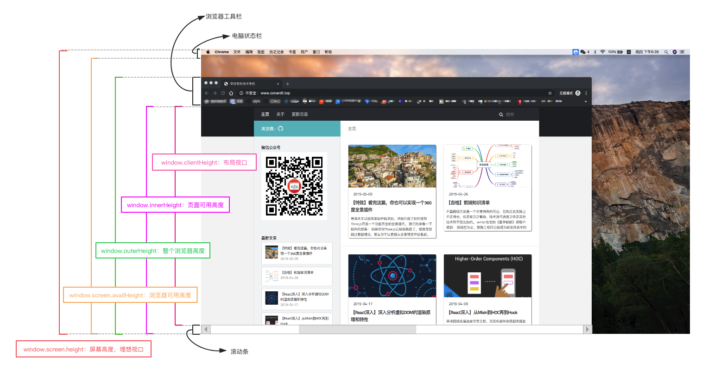

# 移动端适配

<!-- @import "[TOC]" {cmd="toc" depthFrom=1 depthTo=6 orderedList=false} -->

<!-- code_chunk_output -->

- [移动端适配](#移动端适配)
  - [基本概念](#基本概念)
  - [视口](#视口)
    - [布局视口(layout viewport)](#布局视口layout-viewport)
    - [视觉视口(visual viewport)](#视觉视口visual-viewport)
    - [理想视口](#理想视口)
    - [Meta viewport](#meta-viewport)
    - [获取浏览器大小](#获取浏览器大小)
  - [1px问题](#1px问题)
    - [border-image](#border-image)
    - [background-image](#background-image)
    - [svg](#svg)
    - [伪类 + transform 缩放](#伪类-transform-缩放)
    - [设置viewport](#设置viewport)
  - [移动端适配方案](#移动端适配方案)
    - [flexible方案](#flexible方案)
    - [vh、vw方案](#vh-vw方案)
  - [适配iphoneX](#适配iphonex)
    - [安全区域](#安全区域)
    - [viewport-fit](#viewport-fit)
    - [env、constant](#env-constant)
  - [横屏适配](#横屏适配)
    - [javascript 检测横屏](#javascript-检测横屏)
    - [css 检测横屏](#css-检测横屏)
    - [内联样式](#内联样式)
  - [图片模糊问题](#图片模糊问题)
    - [产生原因](#产生原因)
    - [解决方案](#解决方案)
    - [media query](#media-query)
    - [image-set](#image-set)
    - [src-set](#src-set)
    - [javascript 拼接](#javascript-拼接)
    - [使用svg](#使用svg)

<!-- /code_chunk_output -->

## 基本概念

英寸
>指屏幕对角线的长度，1英寸约等于2.54cm

分辨率
>屏幕分辨率1920x1080是指横向有1920个像素点，竖向有1080个像素点。图片分辨率也是一样。分辨率越高越清晰。

ppi（pixel per inch）
>每英寸的像素，由于手机尺寸为手机对角线的长度，我们通常使用如下的方法计算PPI:
$\sqrt{水平像素点数^2+垂直像素点数^2}\div{尺寸}$
iPhone 6的PPI为 $\sqrt{1334^2+750^2}\div{4.7}$=325.6，那它每英寸约含有326个物理像素点。

dpi(dot per inch)
>每英寸点数，和ppi一样，越高越清晰。但是dpi还用于打印

dip(device independent pixel)
>设备独立像素：为保证不同分辨率的移动端设备布局大致相同

dpr(device independent ratio)
>设备像素比：物理像素/设备独立像素

- 浏览器：window.devicePixelRatio
- css中：@media (-webkit-min-device-pixel-ratio: 2),(min-device-pixel-ratio: 2){ } 可以区分 dpr
- React Native：PixelRatio.get()

设备像素比
> window.devicePixelRatio = 设备物理像素 / dips，dips即device-independent-pixels 独立像素

## 视口

### 布局视口(layout viewport)

当我们以百分比来指定一个元素的大小时，它的计算值是由这个元素的包含块计算而来的。当这个元素是最顶级的元素时，它就是基于布局视口来计算的。

```javascript
// 获取
document.documentElement.clientWidth
```

### 视觉视口(visual viewport)

用户通过屏幕真实看到的区域。视觉视口默认等于当前浏览器的窗口大小（包括滚动条宽度）。

```javascript
window.innerWidth
```

### 理想视口

布局视口在移动端展示的效果并不是一个理想的效果，所以理想视口(ideal viewport)就诞生了：网站页面在移动端展示的理想大小。

上面在介绍CSS像素时曾经提到页面的缩放系数 = CSS像素 / 设备独立像素，实际上说页面的缩放系数 = 理想视口宽度 / 视觉视口宽度更为准确。

所以，当页面缩放比例为100%时，CSS像素 = 设备独立像素，理想视口 = 视觉视口。

```javascript
screen.width
```

### Meta viewport

```html
<meta name="viewport" content="width=device-width,initial-scale=1.0,maximum-scale=1.0,minimum-scale=1.0,user-scalable=no,viewport-fit=cover">
```

为了在移动端让页面获得更好的显示效果，我们必须让布局视口、视觉视口都尽可能等于理想视口。

device-width就等于理想视口的宽度，所以设置width=device-width就相当于让布局视口等于理想视口。

由于initial-scale = 理想视口宽度 / 视觉视口宽度，所以我们设置initial-scale=1;就相当于让视觉视口等于理想视口。

这时，1个CSS像素就等于1个设备独立像素，而且我们也是基于理想视口来进行布局的，所以呈现出来的页面布局在各种设备上都能大致相似。

### 获取浏览器大小



- window.innerHeight：获取浏览器视觉视口高度（包括垂直滚动条）。
- window.outerHeight：获取浏览器窗口外部的高度。表示整个浏览器窗口的高度，包括侧边栏、窗口镶边和调正窗口大小的边框。
- window.screen.Height：获取获屏幕取理想视口高度，这个数值是固定的，设备的分辨率/设备像素比
- window.screen.availHeight：浏览器窗口可用的高度。
- document.documentElement.clientHeight：获取浏览器布局视口高度，包括内边距，但不包括垂直滚动条、边框和外边距。
- document.documentElement.offsetHeight：包括内边距、滚动条、边框和外边距。
- document.documentElement.scrollHeight：在不使用滚动条的情况下适合视口中的所有内容所需的最小宽度。测量方式与clientHeight相同：它包含元素的内边距，但不包括边框，外边距或垂直滚动条。

## 1px问题

为了适配各种屏幕，我们写代码时一般使用设备独立像素来对页面进行布局。

而在设备像素比大于1的屏幕上，我们写的1px实际上是被多个物理像素渲染，这就会出现1px在有些屏幕上看起来很粗的现象。

### border-image

基于media查询判断不同的设备像素比给定不同的border-image：

```css
.border_1px{
  border-bottom: 1px solid #000;
}
@media only screen and (-webkit-min-device-pixel-ratio:2){
    .border_1px{
        border-bottom: none;
        border-width: 0 0 1px 0;
        border-image: url(../img/1pxline.png) 0 0 2 0 stretch;
    }
}
```

### background-image

和border-image类似，准备一张符合条件的边框背景图，模拟在背景上。

```css
.border_1px{
  border-bottom: 1px solid #000;
}
@media only screen and (-webkit-min-device-pixel-ratio:2){
    .border_1px{
        background: url(../img/1pxline.png) repeat-x left bottom;
        background-size: 100% 1px;
    }
}
```

上面两种都需要单独准备图片，而且圆角不是很好处理，但是可以应对大部分场景。

### svg

上面我们border-image和background-image都可以模拟1px边框，但是使用的都是位图，还需要外部引入。

借助PostCSS的postcss-write-svg我们能直接使用border-image和background-image创建svg的1px边框：

```css
@svg border_1px {
  height: 2px;
  @rect {
    fill: var(--color, black);
    width: 100%;
    height: 50%;
  }
}
.example { border: 1px solid transparent; border-image: svg(border_1px param(--color #00b1ff)) 2 2 stretch; }
```

编译后：

```css
.example { border: 1px solid transparent; border-image: url("data:image/svg+xml;charset=utf-8,%3Csvg xmlns='http://www.w3.org/2000/svg' height='2px'%3E%3Crect fill='%2300b1ff' width='100%25' height='50%25'/%3E%3C/svg%3E") 2 2 stretch; }
```

### 伪类 + transform 缩放

基于media查询判断不同的设备像素比对线条进行缩放：

```stylus
// 4 border 1px
border-1px($color = #ccc, $radius = 1px, $style = solid)
  position: relative
  &after
    content: ''
    display: block
    position: absolute
    top: 0
    left: 0
    transform-origin: 0 0
    box-sizing: border-box
    width: 100%
    height: 100%
    border: 1px $style $color
    border-radius: $radius
    pointer-events: none
    @media (min-resolution: 2dppx)
      width: 200%
      height: 200%
      border-radius: $radius * 2
      transform: scale(.5)
    @media (min-resolution: 3dppx)
      width: 300%
      height: 300%
      border-radius: $radius * 3
      transform: scale(.333)

// 顶部 border 1px
border-top-1px($color = #ccc, $radius = 1px, $style = solid)
  position: relative
  &after
    content: ''
    display: block
    position: absolute
    top: 0
    left: 0
    box-sizing: border-box
    width: 100%
    height: 100%
    border-top: 1px $style $color
    border-radius: $radius
    transform-origin: 0 0
    pointer-events: none
    @media screen and (min-device-pixel-ratio: 2)
      height: 200%
      border-radius: 2 * radius
      transform: scaleY(.5)
    @media screen and (min-device-pixel-ratio: 3)
      height: 300%
      border-radius: 3 * radius
      transform: scaleY(.333)
```

这种方式可以满足各种场景，如果需要满足圆角，只需要给伪类也加上border-radius即可。

### 设置viewport

通过设置缩放，让CSS像素等于真正的物理像素。

例如：当设备像素比为3时，我们将页面缩放1/3倍，这时1px等于一个真正的屏幕像素。

```javascript
const scale = 1 / window.devicePixelRatio
let viewport = document.querySelector('meta[name="viewport"]')
if (!viewport) {
  viewport = document.createElement('meta')
  viewport.setAttribute('name', 'viewport')
  document.head.appendChild(viewport)
}
viewport.setAttribute('content', `width=device-width,initial-scale=${scale},maximum-scale=${scale},minimum-scale=${scale},user-scalable=no`)
```

实际上，上面这种方案是早先flexible采用的方案。

当然，这样做是要付出代价的，这意味着你页面上所有的布局都要按照物理像素来写。这显然是不现实的，这时，我们可以借助flexible或vw、vh来帮助我们进行适配。

另一方面可能影响到其它ui库的样式。

## 移动端适配方案

### flexible方案

flexible方案是阿里早期开源的一个移动端适配解决方案，引用flexible后，我们在页面上统一使用rem来布局。

核心代码：

```javascript
const docEl = document.documentElement

function setRemUnit () {
  var rem = docEl.clientWidth / 10
  docEl.style.fontSize = rem + 'px'
}

// 保证窗口大小调整时能自动调整布局
window.addEventListener('resize', () => {
  setRemUnit()
})
window.addEventListener('pageshow', (e) => {
  e.persisted && setRemUnit()
})
```

rem 是相对于html节点的font-size来做计算的。

我们通过设置document.documentElement.style.fontSize就可以统一整个页面的布局标准。

上面的代码中，将html节点的font-size设置为页面clientWidth(布局视口)的1/10，即1rem就等于页面布局视口的1/10，这就意味着我们后面使用的rem都是按照页面比例来计算的。

这时，我们只需要将UI出的图转换为rem即可。

以iPhone6为例：布局视口为375px，则1rem = 37.5px，这时UI给定一个元素的宽为75px（设备独立像素），我们只需要将它设置为75 / 37.5 = 2rem。

当然，每个布局都要计算非常繁琐，我们可以借助PostCSS的px2rem插件来帮助我们完成这个过程。

由于viewport单位得到众多浏览器的兼容，上面这种方案现在已经被官方弃用：

> lib-flexible这个过渡方案已经可以放弃使用，不管是现在的版本还是以前的版本，都存有一定的问题。建议大家开始使用viewport来替代此方案。

### vh、vw方案

基于 viewport 的布局

- vw（viewport's width）: 1vw 视觉窗口宽度的 1%
- vh（viewport's height）: 1vh 视觉窗口高度的 1%
- vmin: vw 和 vh 中的较小值
- vmax: vw 和 vh 中的较大值

如果视觉视口为375px，那么1vw = 3.75px，这时UI给定一个元素的宽为75px（设备独立像素），我们只需要将它设置为75 / 3.75 = 20vw。

这里的比例关系我们也不用自己换算，我们可以使用PostCSS的 postcss-px-to-viewport 插件帮我们完成这个过程。写代码时，我们只需要根据UI给的设计图写px单位即可。

缺陷：

- px转换成vw不一定能完全整除，因此有一定的像素差。
- 比如当容器使用vw，margin采用px时，很容易造成整体宽度超过100vw，从而影响布局效果。当然我们也是可以避免的，例如使用padding代替margin，结合calc()函数使用等等...

## 适配iphoneX

### 安全区域

新发布的手机具有圆角（corners）、刘海（sensor housing）和小黑条（Home Indicator）。

安全区域： 安全区域就是除上面三个区域外的可视窗口范围。

为了保证页面的显示效果，我们必须把页面限制在安全范围内，但是不影响整体效果。

### viewport-fit

viewport-fit是专门为了适配iPhoneX而诞生的一个属性，它用于限制网页如何在安全区域内进行展示。

两个属性:

- cover: 网页内容完全覆盖可视窗口
- contain: 可视窗口完全包含网页内容

默认情况下或者设置为auto和contain效果相同。

### env、constant

我们需要将顶部和底部合理的摆放在安全区域内，iOS11新增了两个CSS函数env、constant，用于设定安全区域与边界的距离。

函数内部可以是四个常量：

- safe-area-inset-top: 安全区域距离顶部边界距离
- safe-area-inset-right: 安全区域距离右边边界距离
- safe-area-inset-bottom: 安全区域距离底部边界距离
- safe-area-inset-left: 安全区域距离左边边界距离

注意：我们必须指定viweport-fit后才能使用这两个函数：

```html
<meta name="viewport" content="viewport-fit=cover">
```

constant在iOS < 11.2的版本中生效，env在iOS >= 11.2的版本中生效，这意味着我们往往要同时设置他们，将页面限制在安全区域内：

```css
body {
  padding-bottom: env(safe-area-inset-bottom);
  padding-bottom: constant(safe-area-inset-bottom);
}
```

当使用底部固定导航栏时，我们要为他们设置padding值：

```css
{
  padding-bottom: env(safe-area-inset-bottom);
  padding-bottom: constant(safe-area-inset-bottom);
}
```

## 横屏适配

### javascript 检测横屏

```javascript
window.addEventListener('resize', () => {
  if (window.orientation == 180 || window.orientation == 0) {
    // 竖屏
  }
  if (window.orientation == 90 || window.orientation == -90) {
    // 横屏
  }
})
```

### css 检测横屏

```css
@media screen and (orientation: portrait) {
  /* 竖屏 */

}

@media screen and (orientation: landscape) {
  /* 横屏 */
}
```

### 内联样式

```html
<!-- 竖屏 -->
<link rel="stylesheet" media="all and (orientation:portrait)" href="..." />

<!-- 横屏 -->
<link rel="stylesheet" media="all and (orientation:landscape)" href="..." />
```

- [参考：凹凸实验室-探讨判断横竖屏的最佳实现](https://aotu.io/notes/2017/01/31/detect-orientation/index.html)

## 图片模糊问题

### 产生原因

我们平时使用的图片大多数都属于位图（png、jpg...），位图由一个个像素点构成的，每个像素都具有特定的位置和颜色值：

理论上，位图的每个像素对应在屏幕上使用一个物理像素来渲染，才能达到最佳的显示效果。

而在dpr > 1的屏幕上，位图的一个像素可能由多个物理像素来渲染，然而这些物理像素点并不能被准确的分配上对应位图像素的颜色，只能取近似值，所以相同的图片在dpr > 1的屏幕上就会模糊:

### 解决方案

为了保证图片质量，我们应该尽可能让一个屏幕像素来渲染一个图片像素，所以，针对不同DPR的屏幕，我们需要展示不同分辨率的图片。

如：在dpr=2的屏幕上展示两倍图(@2x)，在dpr=3的屏幕上展示三倍图(@3x)。

### media query

通过媒体查询，不同 dpr 的设备应用不同大小的图片

```css
.avatar {
  background-image: url('image@1x.png');
}
@media screen and (-webkit-min-device-pixel-ratio: 2) {
  .avatar {
    background-image: url('image@2x.png');
  }
}
@media screen and (-webkit-min-device-pixel-ratio: 3) {
  .avatar {
    background-image: url('image@2x.png');
  }
}
```

### image-set

```css
.avatar {
  background: -webkit-image-set('image@2x.png' 2x,'image@3x.png' 3x)
}
```

### src-set

```html

```

### javascript 拼接

```javascript
const images = document.querySelectorAll('img')
const dpr = window.devicePixelRatio

images.forEach(img => img.src = img.src.replace('.', `@${dpr}x.`))
```

### 使用svg

SVG 全称是可缩放的矢量图形（scalable vector graphics）。不同于位图的基于像素，SVG 则是属于对图像的形状描述，所以它本质上是文本文件，体积较小，且不管放大多少倍都不会失真。

除了我们手动在代码中绘制svg，我们还可以像使用位图一样使用svg图片：

```javascript


.avatar {
  background: url(conardLi.svg);
}
```

-[参考：ConardLi-关于移动端适配，你必须要知道的](https://juejin.im/post/6844903845617729549#heading-15)