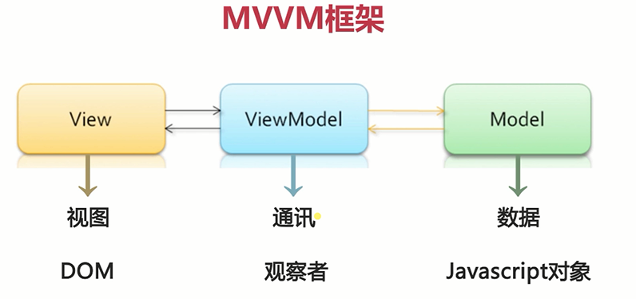
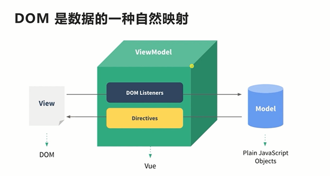
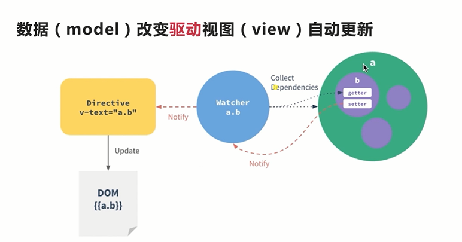
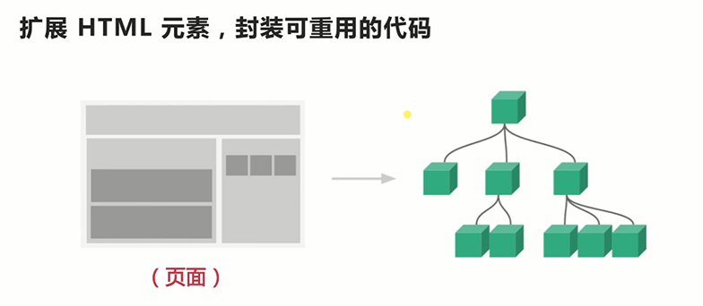

## 近年来前端开发的趋势

1. 旧浏览器逐渐淘汰，移动端需求增加

> ie6-8不支持es5的特性，而ie8+、firefox、chrome都支持es5，另一方面移动端的浏览器都是基于webkit内核的，都支持es5

2. 前端交互越来越多，功能越来越复杂

3. 架构从传统后台的MVC向 REST API + 前端 MV* 迁移

> 传统的后台mvc数据变化需要刷新整个页面，体验不好。现在通过ajax获取数据，异步的局部刷新页面某个部分。

## 什么是MVVM？

### 简介

viewmodel通常要实现一个观察者watcher，当数据发生变化时，watcher能监听到数据的变化，从而驱动视图更新。同时，当视图交互改变，viewmodel也能反馈给model

### MVVM 应用场景

1. 针对具有复杂交互逻辑的前端应用
2. 提供基础的架构抽象
3. 通过ajax数据持久化，保证前端用户体验

## 什么是 vuejs

1. 一个轻量级的 MVVM 框架
2. 数据驱动 + 组件化的前端开发
3. github 超过 star fork

## 对比 Angular React

1. Vue.js更轻量，gzip后大小只有20K+，移动端更友好
2. Vue.js更易上手，学习曲线平稳
3. 吸取两家之长，借鉴了angular的指令和react的组件化

## vuejs 核心思想

### 数据驱动

DOM 是数据的一种自然映射

数据（model）改变驱动视图（view）自动更新

### 组件化

#### 组件设计原则

1. 页面上每个独立的可视、可交互区域视为一个组件
2. 每个组件对应一个工程目录，组件所需的各种资源在这个目录下就近维护
3. 页面不过是组件的容器，组件可以嵌套自由组合形成完整的页面

## 项目准备

### 图片

- css sprite，可以减少图片请求
- 实际项目中，通常将图标变成图标字体文件，图片通过webpack url-loader 变成base64，这样一个图片请求也不用发

### 图片字体制作

