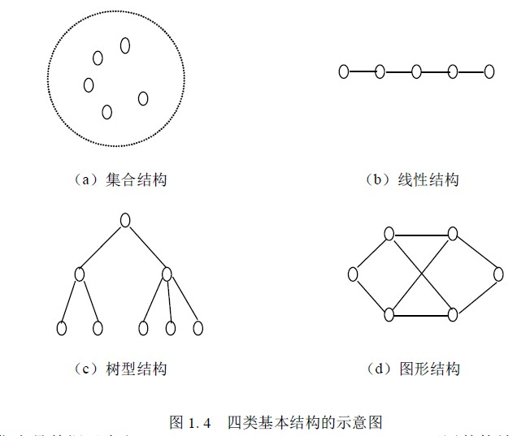
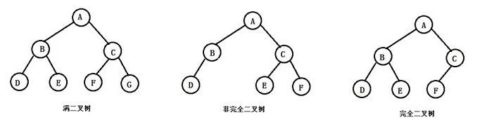

### 什么是数据结构？

数据结构是计算机存储、组织数据的方式。对于特定的数据结构(比如数组)，有些操作效率很高(读某个数组元素)，有些操作的效率很低(删除某个数组元素)。程序员的目标是为当前的问题选择最优的数据结构。

### 基本的数据结构

- 集合结构：数据元素的有限集合。数据元素之间除了“属于同一个集合”的关系之外没有其他关系。
- 线性结构：数据元素的有序集合。数据元素之间形成一对一的关系。
- 树型结构：树是层次数据结构，树中数据元素之间存在一对多的关系。
- 图状结构：图中数据元素之间的关系是多对多的。

### 数据的逻辑结构

- 线性结构：有且仅有一个开始节点和一个终端节点，且所有节点都最多只有一个直接前驱和一个直接后继。**线性表、栈、队列、串、数组**等都是线性结构。
- 非线性结构：在该类结构中至少存在一个数据元素,它具有两个或者两个以上的前驱或后继。**树、多维数组、广义表、图、堆**等都是非线性结构。

线性结构因为存储上是连续的，所以通常可以直接遍历。而线性行结构存储上非连续的，不可直接遍历。比如二叉树的前序、中序、后续遍历通常有迭代和递归两种方式。迭代通常要借用栈（线性结构）来实现。递归也是一种遍历，实际上也是借用函数调用栈来实现的。

### 8 种常用数据结构

数组、栈、队列、链表、图、树、前缀树、哈希表

#### 栈和队列

- 栈：所有的插入和删除都限制在表的同一端进行。允许操作的一端为栈顶，另一端为栈底。无元素的栈称为空栈。特点：后进先出。
- 队列：只允许在表的一端进行插入，在另一端删除。允许删除的一端为表头，允许插入的一端为队尾。无元素的队列称为空队。特点：先进先出。
- 队列的实现：环形队列，维护头节点和尾节点。
- 双端队列：数据项可以从两端分别插入和删除。集成了栈和队列的能力。

### 树

#### 二叉树

定义：每个节点最多有两个分支（子节点）的树，两个分支分别称为左子树和右子树。

二叉树的存储方法

链式存储法：每个节点都是一个Node对象，它包含我们所需要存储的数据，指向左子节点的引用，直向右子节点的引用，就像链表一样将整个树串起来。如果该节点没有左子节点，则Node.left==null或者Node.right==null.

顺序存储法：我们把根节点储存在下标为i=1的位置，那么左子节点储存在2*i=2的位置，右子节点储存在下标为2*i+1=2的位置。依此类推，完成树的存储。借助下标运算，我们可以很轻松的从父节点跳转到左子节点和右子节点或者从任意一个子节点找到它的父节点。如果X的位置为i，则它的两个子节点的下标分别为2i和2i+1,它的父节点的位置为i/2(这里结果向下取整)。

只有完全二叉树存储的效率才最高，最省内存。

常见名词的定义：

- 叶子节点、分支节点：左右子树均为空的节点称为叶子节点，否则称为分支节点。
- 度：节点的非空子树的个数叫做节点的度数。二叉树每个节点度数最大为2。
- 深度：二叉树的深度为根节点到最远叶子节点的最长路径上的节点数
- 深度优先遍历：按照访问根节点的顺序，分为先根次序（前序遍历）、后根次序（后序遍历）、中根次序（中序遍历）。
- 广度优先遍历：从0到h层逐层从左往右访问每个节点。
- 二叉搜索树（二叉排序树）：每个父节点的左子树节点值都比父节点小，右子树节点值都比父节点大。
- 平衡二叉排序树（AVL树）：每个节点左右子树高度之差的绝对值不超过的二叉排序树。

##### 满二叉树和完全二叉树

满二树叉

对于满二叉树，除最后一层无任何子节点外，每一层上的所有节点都有两个子节点二叉树。

定义：一个二叉树，如果每一个层的节点数都达到最大值，则这个二叉树就是满二叉树。也就是说，如果一个二叉树的层数为K，且节点总数是(2^k) -1 ，则它就是满二叉树。

完全二叉树

完全二叉树是效率很高的数据结构，完全二叉树是由满二叉树而引出来的。对于深度为K的，有n个节点的二叉树，当且仅当其每一个节点都与深度为K的满二叉树中编号从1至n的节点一一对应时称之为完全二叉树。

定义：若设二叉树的深度为h，除第 h 层外，其它各层 (1～h-1) 的节点数都达到最大个数，第 h 层所有的节点都连续集中在最左边，这就是完全二叉树。

### 常见算法

- 贪心法：将整个问题分成若干阶段，每一个阶段都选择局部最优方案。
- 分治法：将规模较大问题分成几个较小问题，求解子问题再合并子问题的解，如二分法。
- 回溯法：采用一步一步向前试探的方法，当某一步有多种选择时先任选一种继续向前，无法前进时后退回上一层，即深度优先策略，如迷宫问题。
- 动态规划法：与分治法类似，但分解的子问题较多且子问题相互包含，需要保存计算的中间结果，通常自底向上进行。
- 分枝界限法：与回溯法类似，但采取广度优先策略，利用最优解属性的上下界控制分枝。

### 排序算法

- 冒泡排序：对无序表进行多次比较交换，每次两两相邻比较，并将逆序数据项互换位置。时间开销为O(n^2)，空间开销为O(1)。
- 选择排序：每次比较记录最大项位置，最后与本次比较最后一项交换顺序。时间开销为O(n^2)，空间开销为O(1)。不稳定。
- 插入排序：维持一个已经排好序的子列表，每次将下一个数据项插入已排序列表中。时间开销为O(n^2)，空间开销为O(1)。
- 希尔排序：将整个列表按照d1间隔分割为几个小列表，在小列表内排序，再取间隔为d2（d2 < d1）分割列表，直到dn = 1。时间开销为平均O(nlog(n))，最坏O(n^2)，空间开销为O(1)。
- 归并排序：利用递归算法，将列表分为两半，分别调用归并排序算法，直到子列表仅有一个项；然后按照大小顺序合并两个子列表。时间开销为O(nlog(n))，空间开销为O(n)。
- 快速排序：选取“中值”将列表分为两半，左边项均小于中值，右边项均大于中值，然后在左右列表递归调用快速排序算法。时间开销为平均O(nlog(n))，最坏O(n^2)，空间开销为O(log(n))。

### 递归

三要素

- 递归算法必须有一个基本结束条件（递归出口：最小规模问题的直接解决）。
- 递归算法必须能改变状态向基本结束条件演进（递推公式：减小问题规模）。
- 递归算法必须调用自身（解决减小了规模的相同问题）。

### 参考

- [代码面试需要知道的8种数据结构(附面试题及答案链接)](https://zhuanlan.zhihu.com/p/43023279)
- [《数据结构与算法》知识点整理](https://xzonn.top/posts/Data-Structure-And-Algorithm-Notes.html)

