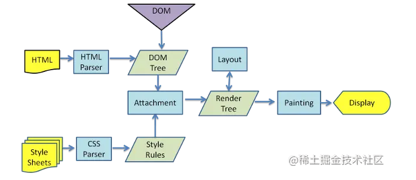

## 重绘和回流

### 浏览器渲染的过程



1. 解析HTML，生成DOM树，解析CSS，生成CSSOM树
2. 将DOM树和CSSOM树结合，生成渲染树(Render Tree)
3. Layout(回流):根据生成的渲染树，进行回流(Layout)，得到节点的几何信息（位置，大小）
4. Painting(重绘):根据渲染树以及回流得到的几何信息，得到节点的绝对像素
5. Display:将像素发送给GPU，展示在页面上(这一步其实还有很多内容，比如会在GPU将多个合成层合并为同一个层，并展示在页面中。而css3硬件加速的原理则是新建合成层)。


### 生成渲染树


1. 从DOM树的根节点开始遍历每个可见的节点。
2. 对于每个可见的节点，找到CSSOM树中对应的规则，并应用它们。
3. 根据每个可见节点及其对应的样式，组合生成渲染树。

#### 不可见节点

- 不会渲染输出的节点： script、meta、link等
- 通过css进行隐藏的节点： display:none。（注意 visibility 和 opacity 隐藏的节点还是会显示在渲染树上）

渲染树只包含可见节点。通过构造渲染树，将可见DOM节点及其对应样式结合起来。

### 回流（重排）

计算DOM节点在设备视口（viewport）的确切位置和大小（几何信息），这个过程就是回流。

比如我们设置某个 div 的 width: 50%，在回流阶段，就需要根据视口的具体宽度计算div width 的实际像素值。

### 重绘

通过构造渲染树和回流阶段，知道了那些节点是可见的，以及可见节点的样式和具体几何信息（位置和大小），就可以将渲染树每个节点都转换为屏幕上的实际像素，这个阶段就叫做重绘。


### 何时发生回流重绘

回流是计算节点的几何信息，那么当几何信息发生变化时，就会触发回流。比如以下情况：

- 添加或删除可见的DOM元素
- 元素的位置发生变化
- 元素的尺寸发生变化（包括外边距、内边框、边框大小、高度和宽度等）
- 内容发生变化，比如文本变化或图片被另一个不同尺寸的图片所替代。
- 页面一开始渲染的时候（这肯定避免不了）
- 浏览器的窗口尺寸变化（因为回流是根据视口的大小来计算元素的位置和大小的）
- 激活CSS伪类（例如：:hover）
- 查询某些属性或调用某些方法

注意：回流一定会触发重绘，重绘不一定会回流

根据改变的范围和程度，渲染树中或大或小的部分需要重新计算，有些改变会触发整个页面的重排，比如，滚动条出现的时候或者修改了根节点。

### 浏览器的优化机制

现代的浏览器都是很聪明的，由于每次重排都会造成额外的计算消耗，因此大多数浏览器都会通过队列化修改并批量执行来优化重排过程。浏览器会将修改操作放入到队列里，直到过了一段时间或者操作达到了一个阈值，才清空队列。但是！当你获取布局信息的操作的时候，会强制队列刷新，比如当你访问以下属性或者使用以下方法：

- offsetTop、offsetLeft、offsetWidth、offsetHeight： 当前元素相对于其 offsetParent 元素；
- scrollTop、scrollLeft、scrollWidth、scrollHeight：相对于视口；
- clientTop、clientLeft、clientWidth、clientHeight： 个元素边框的宽度（以像素表示）。不包括顶部外边距或内边距，只读。[MDN](https://developer.mozilla.org/zh-CN/docs/Web/API/Element/clientTop)
- window.getComputedStyle(el, [pseudoElt]): 返回的style是一个实时的 CSSStyleDeclaration 对象，当元素的样式更改时，它会自动更新本身 [MDN](https://developer.mozilla.org/zh-CN/docs/Web/API/Window/getComputedStyle)
- el.getBoundingClientRect(): 返回元素的大小及其相对于视口的位置（懒加载实现原理），默认按box-sizing:content-box ie盒模型返回，即width 和 height 包含 padding-width、border-width。[MDN](https://developer.mozilla.org/zh-CN/docs/Web/API/Element/getBoundingClientRect)
- 更多参考[What forces layout / reflow](https://gist.github.com/paulirish/5d52fb081b3570c81e3a)

以上属性和方法都需要返回最新的布局信息，因此浏览器不得不清空队列，触发回流重绘来返回正确的值。因此，我们在修改样式的时候，**最好避免使用上面列出的属性，他们都会刷新渲染队列。**如果要使用它们，最好将值缓存起来。

### 减少回流和重绘

#### 最小化回流和重绘

减少发生的次数，比如：

```JavaScript
const el = document.getElementById('test');
el.style.padding = '5px';
el.style.borderLeft = '1px';
el.style.borderRight = '2px';
```

可改为

```JavaScript
// 使用cssText
const el = document.getElementById('test');
el.style.cssText += 'border-left: 1px; border-right: 2px; padding: 5px;';

// 修改CSS的class
const el = document.getElementById('test');
el.className += ' active';
```

#### 批量修改 DOM

1. 使元素脱离文档流（原理：脱离文档流节点就不在渲染树上了）；
2. 对其进行多次修改；
3. 将元素带回到文档中。


该过程的第一步和第三步可能会引起回流，但是经过第一步之后，对DOM的所有修改都不会引起回流重绘，因为它已经不在渲染树了。

有三种方式可以让DOM脱离文档流：

- 隐藏元素，应用修改，重新显示;
- 使用文档片段(document fragment)在当前DOM之外构建一个子树，再把它拷贝回文档;
- 将原始元素拷贝到一个脱离文档的节点中，修改节点后，再替换原始的元素;

```Javascript
function appendDataToElement(appendToElement, data) {
    let li;
    for (let i = 0; i < data.length; i++) {
    	li = document.createElement('li');
        li.textContent = 'text';
        appendToElement.appendChild(li);
    }
}

const ul = document.getElementById('list');
appendDataToElement(ul, data);

// 隐藏元素，应用修改，重新显示
function appendDataToElement(appendToElement, data) {
    let li;
    for (let i = 0; i < data.length; i++) {
    	li = document.createElement('li');
        li.textContent = 'text';
        appendToElement.appendChild(li);
    }
}
const ul = document.getElementById('list');
ul.style.display = 'none';
appendDataToElement(ul, data);
ul.style.display = 'block';


// 使用文档片段(document fragment)
const ul = document.getElementById('list');
const fragment = document.createDocumentFragment();
appendDataToElement(fragment, data);
ul.appendChild(fragment);

// cloneNode
const ul = document.getElementById('list');
const clone = ul.cloneNode(true);
appendDataToElement(clone, data);
ul.parentNode.replaceChild(clone, ul);
```

对于上面这三种情况，参考[demo](https://chenjigeng.github.io/example/share/%E9%81%BF%E5%85%8D%E5%9B%9E%E6%B5%81%E9%87%8D%E7%BB%98/%E6%89%B9%E9%87%8F%E4%BF%AE%E6%94%B9DOM.html)在safari和chrome上测试修改前和修改后的性能。然而实验结果不是很理想。

原因：原因其实上面也说过了，现代浏览器会使用队列来储存多次修改，进行优化，所以对这个优化方案，我们其实不用优先考虑。

### 其它

对于复杂动画效果，由于会经常的引起回流重绘，因此，我们可以使用绝对定位，让它脱离文档流。否则会引起父元素以及后续元素频繁的回流。

由于浏览器使用流式布局，对Render Tree的计算通常只需要遍历一次就可以完成，但table及其内部元素除外，他们可能需要多次计算，通常要花3倍于同等元素的时间，这也是为什么要避免使用table布局的原因之一。

### css3硬件加速（GPU加速）

比起考虑如何减少回流重绘，我们更期望的是，根本不要回流重绘。这个时候，css3硬件加速就闪亮登场啦！！

划重点：
1. 使用css3硬件加速，可以让transform、opacity、filters这些动画不会引起回流重绘 。
2. 对于动画的其它属性，比如background-color这些，还是会引起回流重绘的，不过它还是可以提升这些动画的性能。

常见的触发硬件加速的css属性：

- transform
- opacity
- filters
- Will-change


### css3硬件加速的坑

当然，任何美好的东西都是会有对应的代价的，过犹不及。css3硬件加速还是有坑的:

- 如果你为太多元素使用css3硬件加速，会导致内存占用较大，会有性能问题。
- 在GPU渲染字体会导致抗锯齿无效。这是因为GPU和CPU的算法不同。因此如果你不在动画结束的时候关闭硬件加速，会产生字体模糊。

### 参考链接

- [你真的了解回流和重绘吗](https://juejin.cn/post/6844903779700047885)
- [浏览器的回流与重绘](https://juejin.cn/post/6844903569087266823)