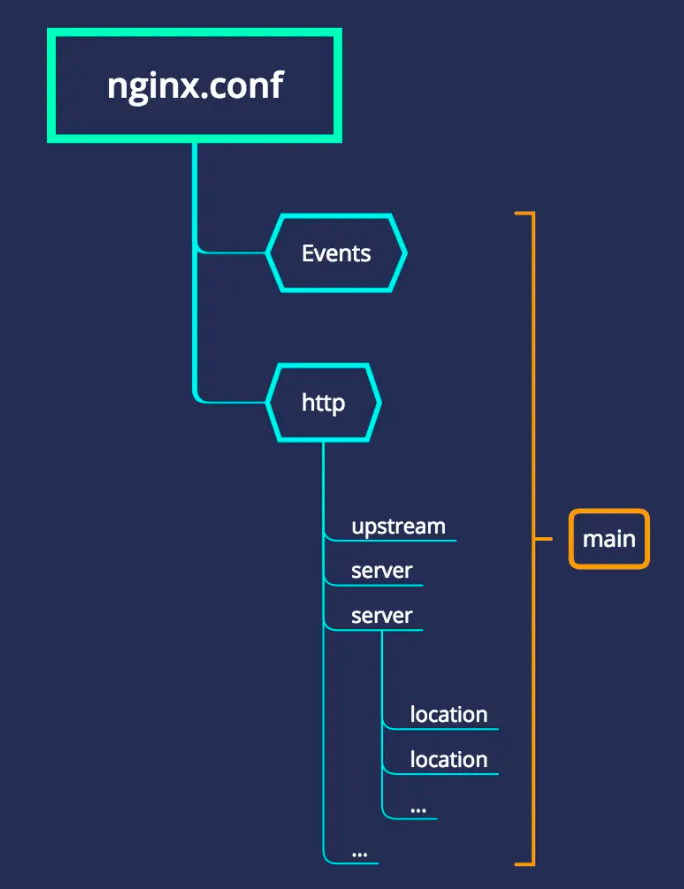

#### 基本结构



```
events { 

}

http 
{
  server
  { 
      location path
      {
        ...
      }
      location path
      {
        ...
      }
    }

  server
  {
    ...
  }
}
```

ubuntu下,nginx.conf 文件在 ```/etc/nginx/nginx.conf```。如下：

```
user www-data;
worker_processes 4;
pid /run/nginx.pid;

events {
        worker_connections 2048;
        use epoll;
        multi_accept on;
}

http {

        ##
        # Basic Settings
        ##

        sendfile on;
        tcp_nopush on;
        tcp_nodelay on;
        keepalive_timeout 300;
        types_hash_max_size 2048;
        client_max_body_size 1024m;
        # server_tokens off;

        # server_names_hash_bucket_size 64;
        # server_name_in_redirect off;

        include /etc/nginx/mime.types;
        default_type application/octet-stream;

        ##
        # SSL Settings
        ##

        ssl_protocols TLSv1 TLSv1.1 TLSv1.2; # Dropping SSLv3, ref: POODLE
        ssl_prefer_server_ciphers on;

        ##
        # Logging Settings
        ##

        access_log /var/log/nginx/access.log;
        error_log /var/log/nginx/error.log;

        ##
        # Gzip Settings
        ##

        gzip on;
        gzip_disable "msie6";


        gzip_vary on;
        gzip_proxied any;
        gzip_comp_level 6;
        gzip_buffers 16 8k;
        gzip_http_version 1.1;
        gzip_types text/plain text/css application/json application/javascript text/xml application/xml application/xml+rss text/javascript;

        ##
        # Virtual Host Configs
        ##

        # 通过 include 引入虚拟主机
        include /etc/nginx/conf.d/*.conf;
        include /etc/nginx/sites-enabled/*;
}
```

通常在```/etc/nginx/```目录下，会有一个 ```sites-available```目录和```sites-enabled```目录。

- sites-available：可用的站点配置
- sites-enabled：正在运行的站点配置

新增服务时，我们通常会在 sites-available 新建一个 xxxsite.conf，然后再软连接到 sites-enabled 目录下。如下：

```
cd /etc/nginx/sites-available
vim site.conf
# 保存后
ln -s /etc/nginx/sites-available/site.conf /etc/nginx/sites-enabled
```


server 常用配置

php

example.conf

```
server {
    listen       8510;
    server_name  localhost;
    set $version 'stable';
    if ($http_version) {
         set $version $http_version;
    }
    set $root_path "/mnt/www/vita/api/$version/public";
    if (!-d $root_path) {
        set $root_path "/mnt/www/vita/api/stable/public";
    }
    root $root_path;
    access_log  off;
    error_log  /var/log/nginx/vita.error.log;
    index index.php index.html index.htm;


    location / {
        try_files $uri $uri/ /index.php?$query_string;

    }

    location ~ \.php {
        fastcgi_index  /index.php;
        fastcgi_pass   unix:/var/run/php/php7.1-fpm.sock;
        include        fastcgi_params;
        fastcgi_split_path_info  ^(.+\.php)(/.+)$;
        fastcgi_param  PATH_INFO $fastcgi_path_info;
        fastcgi_param  PATH_TRNSLATED $document_root$fastcgi_path_info;
        fastcgi_param  SCRIPT_FILENAME $realpath_root$fastcgi_script_name;
    }

    location ~* ^/(css|img|js|flv|swf|download)/(.+)$ {
        root $root_path;
    }

    location ~ /.ht {
        deny all;
    }

}
```
同时会有一个ssl的配置 example.ssl.conf

```
server {
    listen       443;
    server_name  xxx.xxxx.com;

    set $version 'stable';
    if ($http_version) {
         set $version $http_version;
    }

    set $root_path '/mnt/www/vita/api/$version/public';
    root $root_path;
    access_log /var/log/nginx/vita_dev_ssl.access.log;
    error_log  /var/log/nginx/vita_dev_ssl.error.log;
    index index.php index.html index.htm;

    ssl on;
    ssl_certificate /etc/nginx/cert/lx-dev/lxdev.huaguosun.com.pem;
    ssl_certificate_key /etc/nginx/cert/lx-dev/lxdev.huaguosun.com.key;


    location / {
        try_files $uri $uri/ /index.php?$query_string;
    }


    location ~ \.php {
        fastcgi_index  /index.php;
        fastcgi_pass   unix:/var/run/php/php7.1-fpm.sock;
        include        fastcgi_params;
        fastcgi_split_path_info  ^(.+\.php)(/.+)$;
        fastcgi_param  PATH_INFO $fastcgi_path_info;
        fastcgi_param  PATH_TRNSLATED $document_root$fastcgi_path_info;
        fastcgi_param  SCRIPT_FILENAME $realpath_root$fastcgi_script_name;
    }

    location ~* ^/(css|img|js|flv|swf|download)/(.+)$ {
        root $root_path;
    }

    location ~ /.ht {
        deny all;
    }

}
```

admin(网页)

```
server {
    listen 8580;
    server_name lxdev.huaguosun.com;
    gzip on;
    gzip_min_length 1k;
    gzip_comp_level 9;
    gzip_types text/plain application/javascript application/x-javascript text/css application/xml text/javascript application/x-httpd-php image/jpeg image/gif image/png;
    gzip_vary on;
    gzip_disable "MSIE [1-6]\.";

    location / {
        root /mnt/www/polaris/dist;
        try_files $uri $uri/ /index.html;

    }
    location /h5 {
        alias /mnt/www/vita-h5-dist/;
        try_files $uri $uri/ /index.html;
    }

    # 保留 api 的路径
    location /api { 
        proxy_pass http://localhost:8510;
        proxy_set_header   X-Forwarded-Proto $scheme;
        proxy_set_header   Host              $http_host;
        proxy_set_header   X-Real-IP         $remote_addr;
    }

    # 不保留 api，相当于 webpack devServer 的 rewrite: (path) => path.replace(/^\/api/, '')
    location ^~/api2/ {
        proxy_set_header   X-Forwarded-Proto $scheme;
        proxy_set_header   Host              $http_host;
        proxy_set_header   X-Real-IP         $remote_addr;

#        rewrite ^/api2/(.+)$ /$1 break;
        proxy_pass http://localhost:5050/;
    }
}
```

location 字段详解


#### 参考

- [前端开发者必备的Nginx知识](https://juejin.cn/post/6844903793918738440#heading-5)