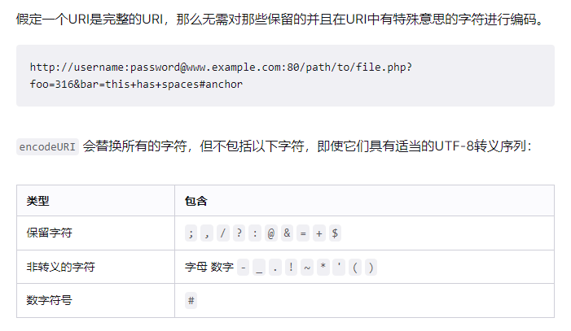

<!-- @import "[TOC]" {cmd="toc" depthFrom=1 depthTo=6 orderedList=false} -->

<!-- code_chunk_output -->

- [计划](#计划)
  - [第一周](#第一周)
- [知识点](#知识点)
  - [一、JS基础](#一-js基础)
    - [1.1 变量和类型](#11-变量和类型)
      - [数据类型的分类](#数据类型的分类)
      - [数据类型的判断](#数据类型的判断)
      - [Number.EPSILON](#numberepsilon)
      - [Number.isNaN](#numberisnan)
    - [1.2 深浅拷贝](#12-深浅拷贝)
    - [1.3 闭包（垃圾回收）、原型链](#13-闭包垃圾回收-原型链)
      - [垃圾回收](#垃圾回收)
    - [1.4 this的原理](#14-this的原理)
    - [1.5 跨域](#15-跨域)
    - [1.6 事件循环](#16-事件循环)
    - [1.7 数精度丢失原因，JavaScript可以存储的最大数字、最大安全数字，JavaScript处理大数字的方法、避免精度丢失的方法](#17-数精度丢失原因javascript可以存储的最大数字-最大安全数字javascript处理大数字的方法-避免精度丢失的方法)
    - [1.8 es6+](#18-es6)
    - [1.9 typescript](#19-typescript)
    - [encodeURI，encodeURIComponent 使用场景，区别](#encodeuriencodeuricomponent-使用场景区别)
  - [JS手写](#js手写)
    - [数组去重](#数组去重)
    - [数组扁平化](#数组扁平化)
    - [高阶函数及实现](#高阶函数及实现)
    - [bind、apply、call的实现](#bind-apply-call的实现)
    - [防抖、节流](#防抖-节流)
    - [new实现及其过程](#new实现及其过程)
    - [继承](#继承)
    - [柯里化和组合](#柯里化和组合)
    - [手动实现符合Promise/A+规范的Promise、手动实现async await](#手动实现符合promisea规范的promise-手动实现async-await)
    - [ajax](#ajax)
    - [jsonp](#jsonp)
    - [手写一个EventEmitter实现事件发布、订阅](#手写一个eventemitter实现事件发布-订阅)
    - [手写JSON.stringify、JSON.parse](#手写jsonstringify-jsonparse)
    - [手写懒加载、下拉刷新、上拉加载、预加载等效果](#手写懒加载-下拉刷新-上拉加载-预加载等效果)
  - [vue基础](#vue基础)
    - [计算属性](#计算属性)
    - [slot插槽](#slot插槽)
    - [组件通信](#组件通信)
    - [render函数](#render函数)
    - [MVVM](#mvvm)
    - [函数式编程](#函数式编程)
    - [双向绑定、响应式原理](#双向绑定-响应式原理)
    - [VueCLi脚手架搭建](#vuecli脚手架搭建)
    - [Vue3.0](#vue30)
    - [composition API](#composition-api)
    - [diff算法](#diff算法)
    - [观察者模式](#观察者模式)
  - [webpack](#webpack)
  - [浏览器](#浏览器)
    - [浏览器缓存](#浏览器缓存)
  - [http](#http)
  - [NodeJs](#nodejs)
  - [样式布局](#样式布局)
    - [重绘(Painting)和回流(重排Layout)](#重绘painting和回流重排layout)
    - [元素分类及特性](#元素分类及特性)
    - [盒模型](#盒模型)
    - [布局基础（浮动和定位）](#布局基础浮动和定位)
    - [BFC](#bfc)
    - [居中](#居中)
    - [flex 布局](#flex-布局)
    - [grid布局](#grid布局)
    - [常见布局（双飞翼...参考阮一峰）](#常见布局双飞翼参考阮一峰)
    - [css预处理器](#css预处理器)
  - [移动端适配](#移动端适配)
  - [数据结构和算法](#数据结构和算法)
    - [二分查找](#二分查找)
    - [二叉树](#二叉树)
    - [排序](#排序)
    - [动态规划](#动态规划)
    - [递归](#递归)
    - [分治](#分治)
  - [项目优化](#项目优化)
    - [webpack 打包](#webpack-打包)
    - [缓存](#缓存)
    - [nginx](#nginx)
- [参考](#参考)

<!-- /code_chunk_output -->

## 计划

### 第一周

- 2020-10-19至2020-10-21 计划完成 js基础部分
- 2020-10-22至2020-10-24 计划完成 js手写部分
- 2020-10-25复习、并作出下周计划

除了完成以上计划，同时阅读完以下内容：

- [神三元 - 原生JS灵魂之问, 请问你能接得住几个？(上)](https://juejin.im/post/6844903974378668039)
- [神三元 - 原生JS灵魂之问(中)，检验自己是否真的熟悉JavaScript？](https://juejin.im/post/6844903986479251464)
- [神三元 - 原生JS灵魂之问(下), 冲刺🚀进阶最后一公里](https://juejin.im/post/6844904004007247880)
- [ConardLi - 前端知识清单](http://www.conardli.top/blog/article/%E7%BB%BC%E5%90%88/%E3%80%90%E8%87%AA%E6%A3%80%E3%80%91%E5%89%8D%E7%AB%AF%E7%9F%A5%E8%AF%86%E6%B8%85%E5%8D%95.html#%E5%BC%80%E7%AF%87)的第一部分【JavaScript基础】

## 知识点

### 一、JS基础

#### 1.1 变量和类型

##### 数据类型的分类

ECMAScript标准规定了7种数据类型，其把这7种数据类型又分为两种：原始类型和对象类型。

原始类型
- Null：只包含一个值：null，表示不应有值。
  - 转为number类型为0。
- Undefined：只包含一个值：undefined。
  - 转为number类型为NaN。
- Boolean：包含两个值：true和false。
  - null、undefined、''、NaN、0、0n 在if中会转为false，其余为true
- Number：整数或浮点数，还有一些特殊值（-Infinity、+Infinity、NaN）。
- String：一串表示文本值的字符序列。
- Symbol：一种实例是唯一且不可改变的数据类型。
  - 不能使用 new Symbol()，使用Symbol('a')创建，因为Symbol是原始类型。
  - Symbol('a') != Symbol('a')，创建相同的Symbol用Symbol.for('a')。
  - 应用：React防止XSS攻击、模拟类的私有变量、对象的不可覆盖属性，防止被污染。
- BigInt（es2020）:  是一种特殊的数字类型，它提供了对任意长度整数的支持。
  - BigInt(10) === 10n
  - BigInt 和number类型混合使用：alert(1n + 2); // Error: Cannot mix BigInt and other types。因为隐式类型转换可能丢失信息，所以不允许在bigint和 Number 之间进行混合操作。当混合使用大整数和浮点数时，结果值可能无法由BigInt或Number精确表示。
  - BigInt 不支持一元加法，可能是某些程序可能依赖于 + 始终生成 Number 的不变量，或者抛出异常。用Number(10n) 来将一个 bigint 转换成一个数字类型。
  - 不能将BigInt传递给Web api和内置的 JS 函数，这些函数需要一个 Number 类型的数字。尝试这样做会报TypeError错误。Math.max(2n, 4n, 6n);    // → TypeError

  - alert( 1 == 1n ); // true。alert( 2n > 1 ); // true。
  - 在 if 中，bigint 0n 为 false，其他值为 true：

对象类型
- Object：自己分一类丝毫不过分，除了常用的Object，Array、Function等都属于特殊的对象
##### 数据类型的判断

1. typeof

可以准确判断 Number、Boolean、String、Undefined、Symbol、BigInt类型的数据。typeof () => {} 返回 function。 typeof null 返回object，这是JavaScript遗留的一个bug。typeof 引用类型的数据都返回object。

2. instanceof

a instanceof A =》 A.prototype 是否能在 a 的原型链上查找到。[] instanceof Array// true；[] instance of Object//true。

实现：

```JavaScript
const instanceOf = (a, A) => {
  if (a === null || typeof a !== 'object') {
    return false
  }

  let proto = Object.getPrototypeOf(a)

  while(proto) {
    if (proto === A.prototype) {
      return true
    }
    proto = Object.getPrototypeOf(proto)
  }

  return false
}

```

3. toString()

每一个引用类型都有toString方法，默认情况下，toString()方法被每个Object对象继承。如果此方法在自定义对象中未被覆盖，toString() 返回 "[object type]"，其中type是对象的类型，也是NativeConstructorName，原生构造函数名。

Array的toString()方法被重写了，[].toString() 返回空串''。事实上，大部分引用类型比如Array、Date、RegExp等都重写了toString方法。

所以我们可以直接用 Object.prototype.toString()，再利用call()来改变this的指向，即 Object.prototype.toString.call([]) // '[ object Array ]'。

```JavaScript
// 数据类型判断工具函数封装

const isType = (type) => (a) => Object.prototype.toString.call(a) === '[ object '+ type +' ]'
// 使用 todo
isType('String')('123') // true

// 获取数据类型
function getType(param) {
  if (param === null) {
    return param + ''
  }

  return typeof param === 'object' || typeof param === 'function' ? Object.prototype.toString.call(param).slice(8, -1).toLowerCase() || 'object' : typeof param 
}
```
 
##### Number.EPSILON


##### Number.isNaN


- [参考：你真的掌握变量和类型了吗](http://www.conardli.top/blog/article/JS%E8%BF%9B%E9%98%B6/%E4%BD%A0%E7%9C%9F%E7%9A%84%E6%8E%8C%E6%8F%A1%E5%8F%98%E9%87%8F%E5%92%8C%E7%B1%BB%E5%9E%8B%E4%BA%86%E5%90%97%EF%BC%88%E4%B8%80%EF%BC%89%E6%95%B0%E6%8D%AE%E7%B1%BB%E5%9E%8B.html#%E5%AF%BC%E8%AF%BB)
- [参考：JavaScript 浮点数陷阱及解法](https://github.com/camsong/blog/issues/9)
#### 1.2 深浅拷贝

#### 1.3 闭包（垃圾回收）、原型链

##### 垃圾回收

内存泄漏：所谓内存泄漏简单来说就是程序不再使用的内存没有及时的释放

标记清除（常用）： 当变量进入执行环境是，就标记这个变量为“进入环境”。从逻辑上讲，永远不能释放进入环境的变量所占用的内存，因为只要执行流进入相应的环境，就可能会用到他们。当变量离开环境时，则将其标记为“离开环境”。

垃圾收集器在运行的时候会给存储在内存中的所有变量都加上标记。然后，它会**去掉环境中的变量以及被环境中的变量引用的标记**。而在此之后再被加上标记的变量将被视为准备删除的变量，原因是环境中的变量已经无法访问到这些变量了。最后。垃圾收集器完成内存清除工作，销毁那些带标记的值，并回收他们所占用的内存空间。

```javascript
var m = 0,n = 19 // 把 m,n,add() 标记为进入环境。
add(m, n) // 把 a, b, c标记为进入环境。
console.log(n) // a,b,c标记为离开环境，等待垃圾回收。
function add(a, b) {
  a++
  var c = a + b
  return c
}

```

引用计数： 所谓"引用计数"是指语言引擎有一张"引用表"，保存了内存里面所有的资源（通常是各种值）的引用次数。如果一个值的引用次数是0，就表示这个值不再用到了，因此可以将这块内存释放。

但是引用计数有个最大的问题： 循环引用

```javascript
function func() {
    let obj1 = {};
    let obj2 = {};

    obj1.a = obj2; // obj1 引用 obj2
    obj2.a = obj1; // obj2 引用 obj1
}
```

当函数 func 执行结束后，返回值为 undefined，所以整个函数以及内部的变量都应该被回收，但根据引用计数方法，obj1 和 obj2 的引用次数都不为 0，所以他们不会被回收。

- [参考： JavaScript中的垃圾回收和内存泄漏](https://juejin.cn/post/6844903833387155464#heading-13)


#### 1.4 this的原理

为什么使用this

this 提供了一种更优雅的方式来隐式“传递”一个对象引用，因此可以将 API 设计得更加简洁并且易于复用。

this 是在运行时进行绑定的，并不是在编写时绑定，它的上下文取决于函数调
用时的各种条件。this 的绑定和函数声明的位置没有任何关系，只取决于函数的调用方式。

当一个函数被调用时，会创建一个活动记录（有时候也称为执行上下文）。这个记录会包含函数在哪里被调用（调用栈）、函数的调用方法、传入的参数等信息。this 就是记录的其中一个属性，会在函数执行的过程中用到。

this 既不指向函数自身也不指向函数的词法作用域，this 实际上是在函数被调用时发生的绑定，它指向什么完全取决于函数在哪里被调用。

#### 1.5 跨域

#### 1.6 事件循环

#### 1.7 数精度丢失原因，JavaScript可以存储的最大数字、最大安全数字，JavaScript处理大数字的方法、避免精度丢失的方法

#### 1.8 es6+

#### 1.9 typescript

#### encodeURI，encodeURIComponent 使用场景，区别

都带有URI，都是为URI服务的函数，component为组件、一部分的意思，那么就好理解了。如果需要对整个uri编码则用encodeURI,如果对uri的组成部分编码则用encodeURIComponent。

都是编码URI，唯一区别就是编码的字符范围

- encodeURI：用于编码完整的URI，接收 URI 的 protocol, host, port 等部分，只对 path 和 query 进行编码；
- encodeURIComponent : 编码范围更广，合适编码URI的参数部分，query等；

具体编码区别：




 总结:
1、如果只是编码字符串，不和URL有半毛钱关系，那么用escape。
2、如果你需要编码整个URL，然后需要使用这个URL，那么用encodeURI。
3、当你需要编码URL中的参数的时候，那么encodeURIComponent是最好方法。

参考:

- [MDN encodeURI](https://developer.mozilla.org/zh-CN/docs/Web/JavaScript/Reference/Global_Objects/encodeURI)
- [escape, encodeURI, encodeURIComponent使用场景](https://juejin.cn/post/6893486834500763655)
### JS手写

#### 数组去重

#### 数组扁平化

#### 高阶函数及实现

#### bind、apply、call的实现

call实现：

```JavaScript
 function mySymbol(obj) {
    // 不要问我为什么这么写，我也不知道就感觉这样nb
    let unique = (Math.random() + new Date().getTime()).toString(32).slice(0, 8)
        // 牛逼也要严谨
    if (obj.hasOwnProperty(unique)) {
        return mySymbol(obj) //递归调用
    } else {
        return unique
    }
}

if (!Function.prototype.call) {
  Function.prototype.call = function () {
    var context = arguments[0] || window
    var i
    var len = arguments.length
    var args = []
    for (i = 1; i < len; i++) {
      args.push(arguments[i])
    }

  }
}
```

#### 防抖、节流

#### new实现及其过程

执行过程：

1.创建一个新的对象obj；
2.将新对象obj的_proto_（隐式原型）指向构造函数的prototype；
3.将构造函数中的this指向新对象obj；
4.执行构造函数中的代码；
5.如果构造函数有返回非空对象则返回此非空对象，否则返回新创建的对象obj。

```JavaScript
if (!Object.prototype.create1) {
  Object.prototype.create1 = function(prototype) {
    const F = function () {}
    F.prototype = prototype // F.prototype.constructor = F
    return new F()
  }
}

function myNew(fn, ...args) {
  const obj = Object.create1(fn.prototype)
  const key = Symbol('fn')
  obj[key] = fn
  const ret = obj[key](...args)
  delete obj[key]
  if(ret && typeof ret === 'object') {
    return ret
  } else {
    return obj
  }
}
function P (name) {
  this.name = name
}
P.prototype.getName = function() {
  return this.name
}

var p1 = new P('leo')
console.log(p1, p1.getName())

var p2 = myNew(P, 'bob')
console.log(p2, p2.getName())
```


#### 继承

寄生组合式继承

```JavaScript
if (!Object.prototype.create1) {
  Object.prototype.create1 = function(prototype) {
    const F = function () {}
    F.prototype = prototype // F.prototype.constructor = F
    return new F()
  }
}

function SuperType(name) {
  this.name = name
  this.list = []
}
SuperType.prototype.getName = function () {
  return this.name
}

function SubType(name, age) {
  SuperType.call(this, name)
  this.age = age
}
SubType.prototype = Object.create1(SuperType.prototype)
SubType.prototype.constructor = SubType
SubType.prototype.getAge = function () {
  return this.age
}
const p = new SuperType('leo')
p.list.push(1)
console.log(p, p.getName(), p.constructor)

const q = new SubType('bob', 18)
q.list.push(2)
console.log(q, q.getName(), q.constructor)
```

#### 柯里化和组合

#### 手动实现符合Promise/A+规范的Promise、手动实现async await

#### ajax

#### jsonp

#### 手写一个EventEmitter实现事件发布、订阅

#### 手写JSON.stringify、JSON.parse

#### 手写懒加载、下拉刷新、上拉加载、预加载等效果

### vue基础

#### 计算属性

#### slot插槽

#### 组件通信

#### render函数

#### MVVM

#### 函数式编程

#### 双向绑定、响应式原理

#### VueCLi脚手架搭建

#### Vue3.0

#### composition API

#### diff算法

#### 观察者模式

### webpack

### 浏览器

#### 浏览器缓存

作用：Web缓存可以**减少延迟加快网页打开速度、重复利用资源减少网络带宽消耗、降低请求次数或者减少传输内容从而减轻服务器压力**。

浏览器HTTP缓存可以分为强缓存和协商缓存。强缓存和协商缓存最大也是最根本的区别是：**强缓存命中的话不会发请求到服务器（比如chrome中的200 from memory cache），协商缓存一定会发请求到服务器，通过资源的请求首部字段验证资源是否命中协商缓存，如果协商缓存命中，服务器会将这个请求返回，但是不会返回这个资源的实体，而是通知客户端可以从缓存中加载这个资源（304 not modified）**。

强缓存的字段有： 

- Programa：Pragma是HTTP/1.1之前版本遗留的通用首部字段，仅作为于HTTP/1.0的向后兼容而使用。虽然它是一个通用首部，但是它在响应报文中时的行为没有规范，依赖于浏览器的实现。RFC中该字段只有no-cache一个可选值，会通知浏览器不直接使用缓存，要求向服务器发请求校验新鲜度。因为它优先级最高，当存在时一定不会命中强缓存。
- Expires： Expires是一个响应首部字段，它指定了一个日期/时间，在这个时间/日期之前，HTTP缓存被认为是有效的。无效的日期比如0，表示这个资源已经过期了。如果同时设置了Cache-Control响应首部字段的max-age，则Expires会被忽略。它也是HTTP/1.1之前版本遗留的通用首部字段，仅作为于HTTP/1.0的向后兼容而使用。
- Cache-Control: 通用首部字段，也是HTTP/1.1控制浏览器缓存的主流字段。和浏览器缓存相关的是如下几个响应指令：
  - max-age：（单位为s）设置缓存的存在时间，相对于发送请求的时间。只有响应报文首部设置Cache-Control为非0的max-age或者设置了大于请求日期的Expires（下文会讲）才有可能命中强缓存。当满足这个条件，同时响应报文首部中Cache-Control不存在no-cache、no-store且请求报文首部不存在Pragma字段，才会真正命中强缓存。
  - private： 响应只作为私有的缓存，不能被CDN、代理服务器等缓存。如果要求HTTP认证，响应会自动设置为private。
  - public： 表明响应可以被浏览器、CDN、代理服务器等缓存。
  - no-cache：表示请求必须先与服务器确认缓存的有效性，如果有效才能使用缓存（协商缓存），无论是响应报文首部还是请求报文首部出现这个字段均一定不会命中强缓存。Chrome硬性重新加载（Command+shift+R）会在请求的首部加上Pragma：no-cache和Cache-Control：no-cache。
  - no-store： 表示禁止浏览器以及所有中间缓存存储任何版本的返回响应，一定不会出现强缓存和协商缓存，适合个人隐私数据或者经济类数据。

协商缓存：与强缓存的区别是：协商缓存一定会发送请求到服务器，协商缓存如果命中，服务器只返回空的实体（304），以告知浏览器可以使用缓存资源。

协商缓存的字段有：

  1.  Last-Modified/If-Modified-Since:  If-Modified-Since是一个请求首部字段，并且只能用在GET或者HEAD请求中。Last-Modified是一个响应首部字段，包含服务器认定的资源作出修改的日期及时间。当带着If-Modified-Since头访问服务器请求资源时，服务器会检查Last-Modified，如果Last-Modified的时间早于或等于If-Modified-Since则会返回一个不带主体的304响应，否则将重新返回资源。
  2.  E-tag/If-No-Match: ETag是一个响应首部字段，它是根据实体内容生成的一段hash字符串，标识资源的状态，由服务端产生。If-None-Match是一个条件式的请求首部。如果请求资源时在请求首部加上这个字段，值为之前服务器端返回的资源上的ETag，则当且仅当服务器上没有任何资源的ETag属性值与这个首部中列出的时候，服务器才会返回带有所请求资源实体的200响应，否则服务器会返回不带实体的304响应。ETag优先级比Last-Modified高，同时存在时会以ETag为准。

> ETag属性之间的比较采用的是弱比较算法，即两个文件除了每个比特都相同外，内容一致也可以认为是相同的。例如，如果两个页面仅仅在页脚的生成时间有所不同，就可以认为二者是相同的。

E-Tag的优点：

    1.  某些情况下服务器无法获取资源的最后修改时间
    2.  资源的最后修改时间变了但是内容没变，使用ETag可以正确缓存
    3.  如果资源修改非常频繁，在秒以下的时间进行修改，Last-Modified只能精确到秒

- [参考文章：浏览器HTTP缓存机制](https://juejin.cn/post/6844903554587574285#heading-0)

### http

### NodeJs

### 样式布局

#### 重绘(Painting)和回流(重排Layout)

- [你真的了解回流和重绘吗](https://juejin.cn/post/6844903779700047885)
- [浏览器的回流与重绘](https://juejin.cn/post/6844903569087266823)
#### 元素分类及特性

#### 盒模型

#### 布局基础（浮动和定位）

#### BFC

#### 居中

#### flex 布局

#### grid布局

#### 常见布局（双飞翼...参考阮一峰）

#### css预处理器

### 移动端适配

### 数据结构和算法

#### 二分查找

#### 二叉树

#### 排序

#### 动态规划

#### 递归

#### 分治

### 项目优化

#### webpack 打包

#### 缓存

#### nginx

- [参考：前端开发者必备的Nginx知识](https://juejin.cn/post/6844903793918738440#heading-19)

## 参考

- [参考：ConardLi的blog](http://www.conardli.top/blog/article/JS%E8%BF%9B%E9%98%B6/%E4%BD%A0%E7%9C%9F%E7%9A%84%E6%8E%8C%E6%8F%A1%E5%8F%98%E9%87%8F%E5%92%8C%E7%B1%BB%E5%9E%8B%E4%BA%86%E5%90%97%EF%BC%88%E4%B8%80%EF%BC%89%E6%95%B0%E6%8D%AE%E7%B1%BB%E5%9E%8B.html)
- [参考：ConardLi - 前端知识清单](http://www.conardli.top/blog/article/%E7%BB%BC%E5%90%88/%E3%80%90%E8%87%AA%E6%A3%80%E3%80%91%E5%89%8D%E7%AB%AF%E7%9F%A5%E8%AF%86%E6%B8%85%E5%8D%95.html#%E5%BC%80%E7%AF%87)
- [参考：神三元 - 原生JS灵魂之问, 请问你能接得住几个？(上)](https://juejin.im/post/6844903974378668039)
- [参考：神三元 - 原生JS灵魂之问(中)，检验自己是否真的熟悉JavaScript？](https://juejin.im/post/6844903986479251464)
- [参考：神三元 - 原生JS灵魂之问(下), 冲刺🚀进阶最后一公里](https://juejin.im/post/6844904004007247880)
- [参考：神三元 - HTTP灵魂之问，巩固你的 HTTP 知识体系](https://juejin.im/post/6844904100035821575)
- [参考：神三元 - 浏览器灵魂之问，请问你能接得住几个？](https://juejin.im/post/6844904021308735502)

- [参考：]()
- [参考：]()