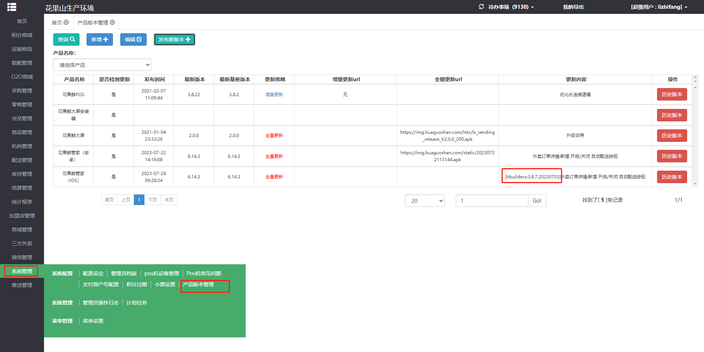

### 说明:本文档基于win10开发环境

## 开发调试

### ios标准基座真机调试

1. 打开hbuilderx，点击运行，选择“运行到手机或模拟器”，选择"运行到ios基座app"，打开界面如下：

CoderLee是你连接到电脑的手机，需要打开开发者模式，iPhone打开【设置】-【隐私与安全性】，拉到底部，就可在“安全性”一栏看到开发者模式了。

2. 选择“使用标准基座运行”，会要求你进行 Apple证书签名，其中“证书profile文件” 和 “私钥证书P12文件” 均在项目目录的“certificates” 文件夹下，注意选带“development”的，为测试用。
证书私钥密码为“uaUMG7ZTmnn6” ，其他值如图：

点击开始签名，即可生成签名。

3. 返回上个界面，点击运行，即可在 ios设备上生成基座调试app。

- [参考：使用Apple证书签名iOS标准基座
](https://uniapp.dcloud.net.cn/tutorial/run/ios-apple-certificate-signature.html)

### Android标准基座真机调试

1. 打开hbuilderx，点击运行，选择“运行到手机或模拟器”，选择"运行到ios基座app"，打开界面如下：

同样 Android 手机也需要打开开发者模式，开启usb调试。

2. 点击运行即可

## 打包上线

### 热更新/增量更新/wgt包

1. 需要先确认本次使用的 hbuilderx 版本是否跟上次全量更新时版本一致，如果hbuilderx版本不一致，不能发wgt增量包，会因为基座不兼容导致线上出错。

如上图，确认上次全量更新的 hbuilderx 版本和当前要制作wgt资源包的hbuilderx版本一致。

2. hbuilderx 打开项目的 manifest.json文件，填写“应用版本名称”和“应用版本号”，注意都必须大于上次发版的值。

3. hbuilderx 菜单 “发行” -> “制作移动App资源(wgt)升级包”，如下图：

点击“确定”，未登录会要求先登录

登录账号密码如下：
- huaguoxian@huaguoshan.com
- Huaguoshan2019

4. 将生成的wgt文件重命名并上传到七牛云，花果鲜管家的升级包都放在 hgsimage 的 static 目录下，如图：

七牛云账号密码：
- songjintong2623@dingtalk.com
- nJqCiQVWnC2QQZ@-

假定本次发版的“应用版本名称”和“应用版本号”分别为 “6.14.4”和“824”，那么wgt资源文件应该命名为“6144_824.wgt”，上传成功后如图：

5. 七牛云“复制外链”，到花果鲜admin填写新版本信息，提交后app端代码才会检测增量更新，Android和ios都需要发新版本，以ios为例，如下图：

- 更新策略: 选择增量更新
- 发布版本号: 跟“应用版本名称”保持一致
- 当前基座版本: 上一个全量更新的版本号
- 增量更新地址: 上传到七牛云的wgt资源外链
- 更新内容: 本次增量更新内容，最好带上hbuilderx 版本号，以方便确定下次能否增量更新，hbuilderx版本一致才可进行增量更新，否则只能全量更新。

说明：Android和ios基本一致，需要多填一项“apk安装包地址”，直接复制上次全量更新的apk包地址填上即可。

- [参考：App资源在线升级更新](https://ask.dcloud.net.cn/article/182)

### 原生app云打包/全量更新

1. 打开HBuilderX，然后点击“发⾏”-->“原⽣APP-云打包”，安卓 ios 分别如下图

其中Android的证书别名\私钥密码分别是:
- huaguoshan
- uaUMG7ZTmnn6
iOS的密码则是:
- 123456

证书文件在项目目录certificates文件夹下。

点击包可分别生成安卓、ios包。周五打包可能要排队很久。

2. 修改Android和iOS的APP包名为“com.huaguoshan.company”

3. 将apk上传到对应的Android市场，我们是要上传到firm。

- 地址： https://account.betaqr.com.cn/signin
- 账号： tech@huaguoshan.com   
- 密码： huaguoshan2015

4. iOS则需要上传到appstore。

appuploader 需要登录 apple账户提交，审核通过后可发布。
- wf@huaguoshan.com
- Huaguoshan2015

登录到[App Store Connect](https://appstoreconnect.apple.com/login),上发布，账号密码同上。

[win10上传参考文档](https://juejin.cn/post/6982761543616167949#comment)

#### 更多信息可参考刘星星交接文档